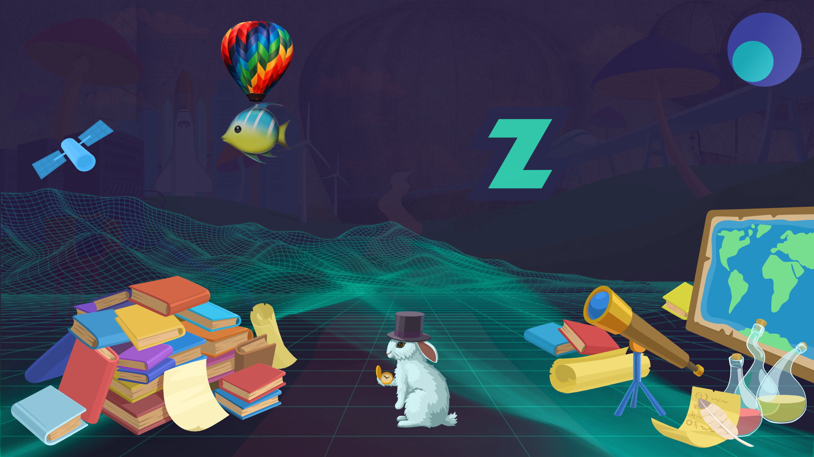
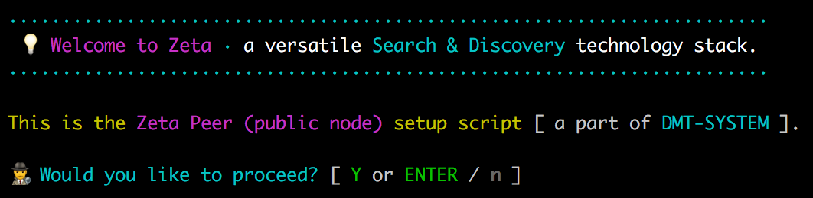
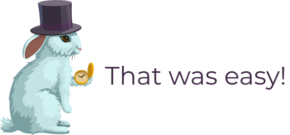
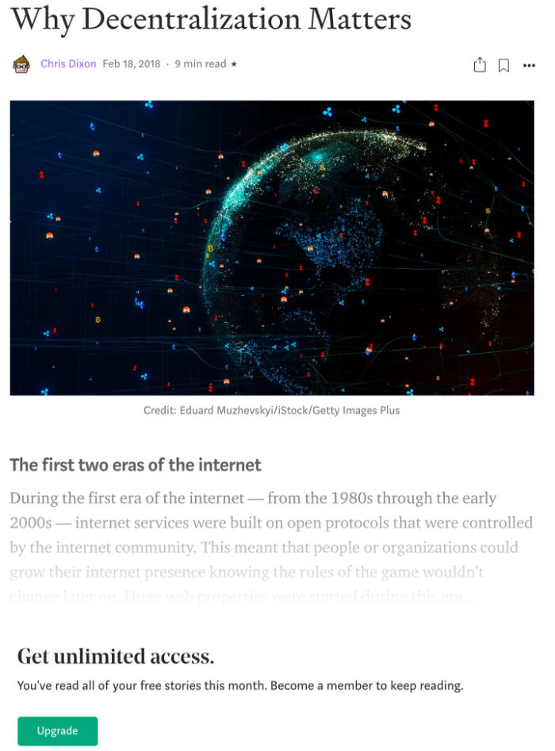

# 1️⃣ **Setup the ZETA EXPLORER NODE** {⏱️10 min}

**PREREQUISITES:** Get a fresh **Debian/Ubuntu linux server** (from [DigitalOcean](https://www.digitalocean.com/)?) and ⚙️ [SET IT UP](./help/SERVER_SETUP.md) (⏱️ **5 min** max)

Here is some background reading: [WHAT IS A ZETA EXPLORER NODE ?](./help/ZETA_BACKGROUND.md)

🔎 Here is an [Example Node (zetaseek.com)](https://zetaseek.com) (only Search for now)

💡There are **no registrations needed** in this 10min setup process (except for your third party bare-metal server provider)

🔐 Secure asymmetric cryptography is utilized to protect sensitive channels (inter-node communication)

🔗 This is not a blockchain project at its core. We believe in great blockchains but this network does not produce blocks.

---

### Login to your server

After successful login to your **⚡new remote computer⚡** with your *non-root username*:

```
ssh username@ip
```

 continue with setup:

```
sudo apt-get update
sudo apt-get -y install git
```

### **We are now ready** to install the [dmt-system](https://dmt-system.com) 👋👽🚀

⏱️ **2 min** max

This is the 🚂 **engine** that runs our node and connects to other network nodes.

Install (everything stays neatly inside the `~/.dmt` directory):

```
git clone https://github.com/uniqpath/dmt.git ~/.dmt
cd ~/.dmt
./install
```

(ignore the `node.js is not installed` message for now).

Now enter `source ~/.bashrc` *to reload the shell* OR *logout and then ssh back* to achieve the same.

### **We are now ready** to setup the 🐠 **Zeta Explorer Node**

⏱️ **3 min** max

```
zeta_setup
```

Remember to logout and login if you get this error: `zeta_setup: command not found`.

The correct **welcome screen** indicating that the script is ready to run looks like this:



✨**That's it**, follow the instructions on screen 👣 🐇 

This manual on GitHub is now concluded (short, eh? :) We wanted to utilize *the absolute minimum number of steps* for the most effect (getting a very useful personal server) to help you start (or perhaps continue) your journey into new exciting realms of **distributed performant computing⚡**. 

<p align="center">
  
</p>

**TIP**💡 Search is just one thing. A start, not a destination.

### ✓ Successful install 🎉

After the script is done, you should be able to open `http://server_ip:7777/apps/zeta`. 

# 2️⃣ Support info 🆘

✉️ **Lighttpd webserver setup** (https, zetaseek subdomain etc.) docs *available on request* — please write to zeta@uniqpath.com (or come talk to us at Discord chat server). This part will soon be integrated in **Zeta Explorer Node** GUI but it is not yet.

#### ⚠️ Important

Make sure ports `7777` (for GUI) and `7780` (Zeta ws communication port) are not blocked by a firewall.

💡To update `~/.dmt` to new version manually in the future if auto-updates fail for some reason use: `dmt next`.

#### 🆘 Support

For any support questions please [Join our Discord server](https://discord.com/invite/XvJzmtF).

You can also use zeta@uniqpath.com email to contact your decentralized tech support 🤓.

For live Q&A / DEMO please join one of ZetaMeet meetups each friday at 5pm CET. Write us for invite, these are not yet public.

# 3️⃣ The rest

#### 🤠 Product architect

Basic information about the main coder on the project (so far) — [Personal Website](https://davidkrmpotic.com/).

I'm actually looking for new friends... so join the search network, we might bump into each other ;) 

Bring **your friends** too. Talk to them and share with them privately and securely p2p from your server (node) to theirs! 

**The node is yours!** 🌎

What about simple p2p games? 🎮 Not yet! If you like developing simple games in the browser let us know!

#### 🎢 The Web 2.0 Way

I'm getting less and less findable on things like Facebook and LinkedIn, these seem quite obsolete by now (in general too much wasted time and way too much noise). LinkedIn promised to change the world and **just before** they would supposedly **start actually doing it**, the flamboyant, soft spoken and kind CEO left with many millions of dollars 💵🤑. Makes you wonder :) Or does it? It kind of makes sense. It's just the first wave of things that at the end didn't really change the world (at least not profoundly) but at least did *help start* a new wave of innovation which is making them obsolete. CEO deserves millions for trying but not for overpromising... what can we do though. Promises sound nice and people buy into them all the time.

If I am less findable then others are also less findable for me. Many people feel the same, I see it all around the web "in various hidden channels". They want to connect but do so in smaller groups and increasingly under their own terms with full control over their experience going forward. The web2 motto **"attract, then extract"** is getting into public scrutinity.



The irony! Don't worry though, we have [freed this article](https://david.zetaseek.com/?q=Why%20Decentralization%20Matters%20-%20by%20Chris%20Dixon&mode=1) for you to enjoy and get flabbergasted™ by. We believe it was locked in opposition to good taste and maybe even the Internet law ⚔️. Unlock 🔐 the true knowledge, make basic logic great again! 

...

I live in a small city and there is a limitation to how much interesting conversations I can have offline. In general there must be new interesting ways of building small communities of passionate *similar-minded* explorers with right balance of personal freedom, governance powers and network effects for greater good. I know this is true because now we have much more great components to build such things from. We just have to *try*. And many **are trying**. I'm one of them. I want you to be as well if you already aren't. I also want you to try to find out what is possible with **Zeta / DMT** platform already. We're just one project but who knows, maybe we'll be the best in some niche(s).

Barrier to entry for this platform is having your own server. Managing a server is still not 100% trivial and will never be but is pretty close which wasn't the case just a year ago. Things change and usually the majority doesn't notice right away but some do 🕵️. Some of us are attracted to new things because we are constantly bored with stuff that is already settled. This is a blessing 😇 but also a curse 😈.

We will organize for all current **peers** running Zeta node already to contribute a similar paragraph of **their vision of progress**. We live in interesting times and it would be great to see other peoples' thinking in regard to this. These opinions will be ready by **Nov or Dec 2020**.

#### ㊙️ I have a secret to tell

I am very afraid. Deep down I'm afraid of things that are broken, do not work as expected and waste peoples' time.

I want this project to be different.

#### 🗓️ The plan

We move slowly but we keep on moving! 🐍

A little progress every day turns out to be a lot in long term. 

Zero progress each day and nothing ever happens. 😶

**Most important:** recognize other great projects and work together for even greater total impact (**2+2=5** 😅).

🐠 **Happy exploration!**