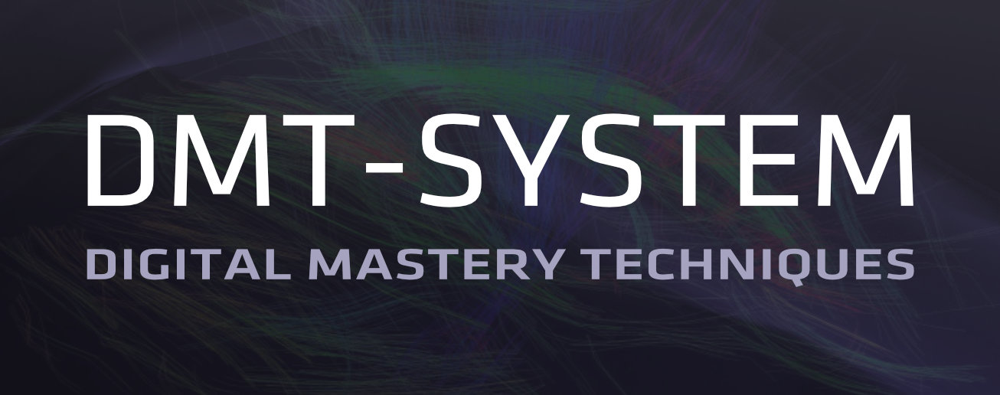

## Try DMT on you computer

Clone the repo:
```
git clone https://github.com/uniqpath/dmt.git ~/.dmt
```

Run dmt-proc in terminal foreground
```
cd ~/.dmt/core/node/controller/daemons
node --experimental-modules --experimental-specifier-resolution=node --unhandled-rejections=strict dmt-proc.js
```


# Prerequisites:

**Linux** (Debian, Raspbian etc.) / **macOS** / **Windows 10 Ubuntu shell**:

`node.js >= 14.0.0`

Install with [n](https://github.com/tj/n) (recommended).

Like this:

```
curl -L https://git.io/n-install | bash
```

## dmt-proc


### Daemonize the process

One time preparation:
```
cd ~/.dmt
./install
source ~/.dmt/shell/.loader
```

Start daemonized
```
dmt start
```

## DMT-GUI

[http://localhost:7777](http://localhost:7777)

## Read help

It's written well, please read.

```
dmt help
```

### A few interesting commands:

See all other dmt-processes on your LAN:
```
dmt nearby
```


See `dmt-proc` in-memory state:
```
dmt state
```

See incoming and outgoing `fiber connections` (try opening `http://localhost:7777` first):
```
dmt connections
```

## Alternative dmtSource

There is an equivalent version available from [get-dmt.com](http://get-dmt.com) (one line install `curl get-dmt.com | bash`).

### Updating

If you installed from github, you can just `git pull` to get the new version.

If you ran `./install` and you have `dmt` command available, then you can use `dmt next` to get the next relase (from github as well as get-dmt.com).

```bash
$ dmt next

dmtSource: get-dmt.com

Current version : 1.1.91 · 2020-11-06
Next version    : 1.1.94 · 2020-11-13

Do you want to update? …
```

## DMT on server

Please reach out for instructions (join a meetup via [dmt-system.com](https://dmt-system.com) or contact us on [Discord support](https://discord.gg/XvJzmtF)).

Server setup instructions are easy as well but some guidance can only help.


## Visit the Website to always learn more

[dmt-system.com](https://dmt-system.com) 💡🚀🎸 (built with **[Svelte](https://svelte.dev) + [Connectome](https://github.com/uniqpath/connectome)**)


