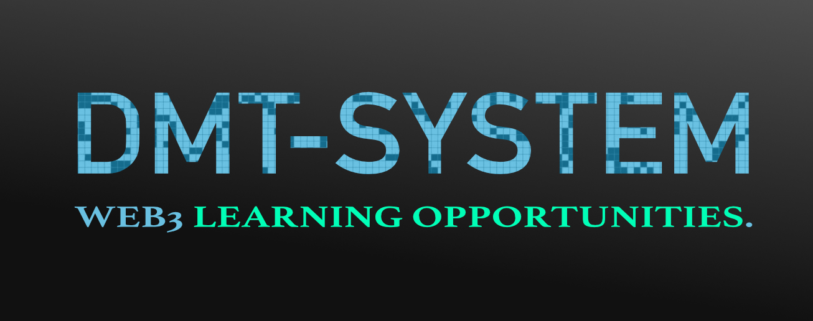

<p align="center"><b>— PRESENTING —</b></p>


<p align="center"><b>Imagine having a Private Search Node 🌐</b></p>


# 1️⃣ **Setup the ZETA EXPLORER NODE** {⏱️10 min}

**PREREQUISITES:** Get a fresh **Debian/Ubuntu linux server** (from [DigitalOcean](https://www.digitalocean.com/)?) and ⚙️ [SET IT UP](./help/SERVER_SETUP.md) (⏱️ **5 min** max)

Here is some background reading: [WHAT IS A ZETA EXPLORER NODE ?](./help/ZETA_BACKGROUND.md)

🔎 Here is an [Example Node (zetaseek.com)](https://zetaseek.com) (only Search for now)

💡There are **no registrations needed** in this 10min setup process (except for your third party bare-metal server provider)

🔐 Secure asymmetric cryptography is utilized to protect sensitive channels (inter-node communication)

🔗 This is not a blockchain project at its core. We believe in great blockchains but this network does not produce blocks.

---

### Login to your server

After successful login to your **⚡new remote computer⚡** with your *non-root username*:

```
ssh username@ip
```

 continue with setup:

```
sudo apt-get update
sudo apt-get -y install git
```

### **We are now ready** to install the [dmt-system](https://dmt-system.com) 👋👽🚀

⏱️ **2 min** max

This is the 🚂 **engine** that runs our node and connects to other network nodes.

Install (everything stays neatly inside the `~/.dmt` directory):

```
git clone https://github.com/uniqpath/dmt.git ~/.dmt
cd ~/.dmt
./install
```

(ignore the `node.js is not installed` message for now).

Now enter `source ~/.bashrc` *to reload the shell* OR *logout and then ssh back* to achieve the same.

### **We are now ready** to setup the 🐠 **Zeta Explorer Node**

⏱️ **3 min** max

```
zeta_setup
```

Remember to logout and login if you get this error: `zeta_setup: command not found`.

The correct **welcome screen** indicating that the script is ready to run looks like this:


✨**That's it**, follow the instructions on screen 👣 🐇

This manual on GitHub is now concluded (short, eh? :) We wanted to utilize *the absolute minimum number of steps* for the most effect (getting a very useful personal server) to help you start (or perhaps continue) your journey into new exciting realms of **distributed performant computing⚡**.

<p align="center">
  
</p>

**TIP**💡 Search is just one thing. A start, not a destination.

### ✓ Successful install 🎉

After the script is done, you should be able to open `http://server_ip:7777/apps/zeta`.

# 2️⃣ Support info 🆘

✉️ **Lighttpd webserver setup** (https, zetaseek subdomain etc.) docs *available on request* — please write to zeta@uniqpath.com (or come talk to us at Discord chat server). This part will soon be integrated in **Zeta Explorer Node** GUI but it is not yet.

#### ⚠️ Important

Make sure ports `7777` (for GUI) and `7780` (Zeta ws communication port) are not blocked by a firewall.

💡To update `~/.dmt` to new version manually in the future if auto-updates fail for some reason use: `dmt next`.

#### 🆘 Support

For any support questions please [Join our Discord server](https://discord.com/invite/XvJzmtF).

You can also use zeta@uniqpath.com email to contact your decentralized tech support 🤓.

For live Q&A / DEMO please join one of ZetaMeet meetups each friday at 5pm CET. Write us for invite, these are not yet public.

🐠 **Happy exploration!**
