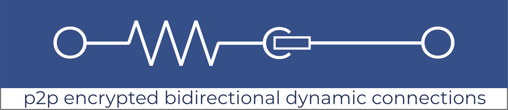

### Purpose

This library was created to implement:

- a LAN-decentralized music player _(currently under further development)_
- a fully decentralized search network _(currently in growth phase and also under heavy development)_

This library was extracted from them for use on further [dmt-system experiments](https://github.com/dmtsys). Both player and network backend and frontend **all-in-one** _(≡ full node)_ solution is at [uniqpath/dmt](https://github.com/uniqpath/dmt). 

### Symbol

Connectome logo uses the [resistor](https://en.wikipedia.org/wiki/Resistor) symbol because library helpes individuals push through resistance of the world's cabling and wireless networks to deliver their messages reliably, safely and as directly as possible. 

### Connectome Library use on other projects

API is not yet stable but getting there! Please wait until v1.0 release if you want to use this library for your projects.

### Documentation

Soon. To help review the currently available docs write to hello@uniqpath.com or join one of **[friday dmt meetups](https://dmt-system.com)**.

### Showcases

See [here](./help/SHOWCASES.md).

## Seeya!

