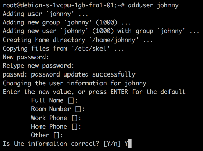
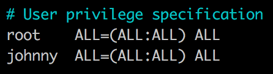

### CREATE A DIGITAL OCEAN (OR SIMILAR) AFFORDABLE SERVER INSTANCE

https://zetaseek.com/?q=digital%20ocean%20manual&mode=1

### SSH into it

```
ssh root@server_ip
```

Enter your <b>root password</b> (visible from Digital Ocean) if requested.

### Add your non-root user:

After successful login to your new server enter this command

```
adduser [your_name]
```

to add a first "normal user" besides <i>root user</i>.

Example:

```
adduser johnny
```



### Assign yourself sudo rights:

```
sudo nano /etc/sudoers
```

```
# User privilege specification
root    ALL=(ALL:ALL) ALL
[your_name]  ALL=(ALL:ALL) ALL     ← add this line
```



Press `ctrl+o [enter]` to save changes in `nano` editor, then `ctrl+x` to quit.

### Swith to your new user:

```
su [your_name]
```

### Add public key from the machine you usually log in from:

By doing this you won't have to type the password yeach time you ssh into your server.

```
mkdir -p ~/.ssh
nano ~/.ssh/authorized_keys
```

Paste your public key (contents of `~/.ssh/id_rsa.pub` on your local machine) into the `nano` editor.

Save and exit editor as before (`ctrl+o`, `ctrl+x`).

### Logout and try to log back in as the new user

```
exit
```

Then from your local machine:

```
ssh [your_name]@server_ip
```

🔙 [RETURN TO ZETA EXPLORER NODE SETUP INSTRUCTIONS](../README.md#login-to-your-server)

