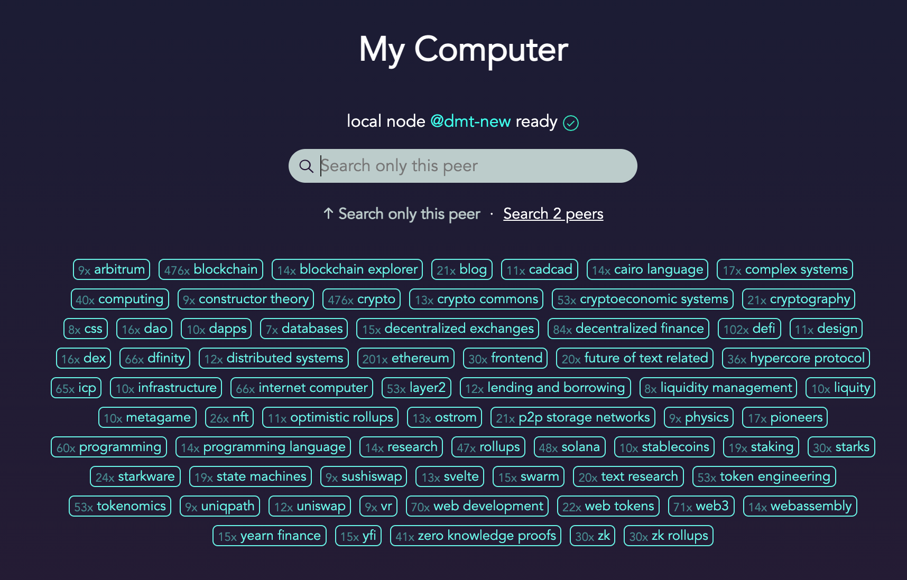

This is a fully decentralized search engine without any [bootnodes](https://ethereum.stackexchange.com/questions/44265/how-does-a-bootnode-work). It can be used on one or more users’ machines and nodes can interconnect. One node running in production is [ZetaSeek.com](https://zetaseek.com), it serves as a demo and also has useful content focused on modern Web3 technologies. It <i>follows (has a long-running connection to)</i> some other public Zeta nodes which means that you search on the entire subnetwork / subgraph when typing queries into ZetaSeek GUI. 

⚠️ **It is suitable for curious early adopters.** Everything implemented *should just work*, **there are no known bugs** but the ease of setup and usage will be much better as times goes on.

Anyone installing the software locally can also easily download zetaseek search index and search over it fully in private. This is described in detail in part two of this tutorial. You can also add your own links and use this as a cool bookmarking service / search engine. Searches directly in file system are also very much supported. 

This is a longterm project, we’re in 2nd year now. Here is the [developer portal](https://dmt-system.com) in development :) 👷It will progress in Q4 2021.

The entire project is fully open source with no plans of monetization, just searching for some valuable people to run public nodes so they can follow each other (node to node follow means that searches on one node go to all peers in cluster). This helps users (including the developers working on this project) find more great stuff on the internet without any gatekeepers / middlemen.

Users can, of course, only choose to use this technology on their own local network or only localhost at first (or forever) as well. **It is flexible.** When running a public node they can only choose to reveal its location to selected people as they see fit.

## 1. This is part one of the tutorial (localhost)

**Or it can be part two as well, it depends!**

If you want to start with your public DMT Search node on your personal server, [FOLLOW PART TWO](./ZETA_NODE.md) first.

You can then continue with this guide. 

Actually any order is ok, depending on your preferences (this is a simpler start than having your Public DMT Search node first).

If you have a **Linux** or **macOS** personal computer, you can then continue with this guide ...

It also works on **Windows 10 Ubuntu shell** but you'll have to figure out things for yourself a bit. It is not hard though.

## DMT Search on your personal computer

### Start by fetching a DMT ENGINE

Follow [DMT ENGINE Install instructions](../README.md) to get the ENGINE on your Personal Computer, then come back to this document.

⏱️ It only takes a minute, you'll be up to speed in an instant!

Run the process with `dmt run` (terminal foreground) or `dmt start` (background).

## Open DMT Search app on your computer

It should be available at [http://localhost:7777/search](http://localhost:7777/search).

<p align="center"></p>

You will see this screen. Try searching for something! You won't find anything. What now?

## 1. Include some directories

```bash
nano ~/.dmt/user/devices/this/def/content.def
```

Add directories under __default content__:

```
content:
  path: ~/Files
  path: ~/Desktop
```

Default content is the one without anything after `content:`. We added `~/Desktop` here.

Restart `dmt-proc` with `dmt restart` and try searching for something on your desktop.

⚠️ Do not try to include directories with _too many files_ for now because searches can take too long. 

**Reason:** We don't yet have indices for contents on files system. Positive side of this is that everything is up to date allways. Negative side is performance in cases of lots of files or slow devices (like RaspberryPi). We are working on next steps in this regard but it is not important for following the point of this tutorial further.

## 2. Follow someone

```
nano ~/.dmt/user/devices/this/def/connect.def
```

Make the contents of this file look like this:

```
connect: zetaseek.com
```

Now restart `dmt-proc` once again and see this:

<p align="center"></p>

Try some search now and see what happens! 

💡You are actually searching on your machine **and at** ZetaSeek node at the same time (provided that you have _Search 2 peers_ options selected).

Benefits of this are convenience, minus side is "some loss of privacy" because ZetaSeek node now sees all your queries (except of course if you select "Search only this peer").

## 3. Download entire link search index from someone

We will download the search index from ZetaSeek node in this example.

ZetaSeek node operator decided to open up their webindex directory like this:

```
content:
  path: /home/zeta/.dmt-here/webindex
```

This is a temporary hack until real webindex replication / syncing is implemented.

In any case this means that you can try searching for `webindex` at [ZetaSeek.com](https://zetaseek.com):

<p align="center"></p>

Right-click on the search result `zeta.json` and copy the url, it should be this one:

https://zetaseek.com/file/zeta.json?place=localhost-2f686f6d652f7a6574612f2e646d742d686572652f776562696e646578

Now do this:

```
mkdir -p ~/.dmt-here/webindex && cd $_
curl -L https://zetaseek.com/file/zeta.json?place=localhost-2f686f6d652f7a6574612f2e646d742d686572652f776562696e646578 -o zetaseek.json
```

Your situation should look like this now:

```
~/.dmt-here/webindex$ tree
.
└── zetaseek.json

0 directories, 1 files
```

Wait a few seconds (no need to restart `dmt-proc` this time) and try searching for something again on your localhost.

You can experiment with both options ("Search only this peer" vs "Search 2 peers").

You will see search results coming from your zetaseek-replicated webindex tagged with yellow `zetaseek` tag like this:

<p align="center"></p>

This means that these results are coming from `zetaseek.json` file in your local `~/.dmt-here/webindex` directory.

🚧 There is a 1:1000 chance that you downloaded a corrupted `zetaseek.json` file, try doing it again in case you don't see `zetaseek` search results in your local Search node after more than 10s have passed. Reason is that ZetaSeek.com node operator was just in the process of updating the search index in non-atomic way. This problem will go away in next evolution of DMT link index syncing technology.

🐠 We plan to automate index replication next but for now it is useful to see and learn the difference by doing things manually. Another benefit is that this way you are already living in the future of this <i>great technology</i> (at least some think it's great :).

If you select _Search 2 peers_ option now you will get duplicate results because you will be live-searching ZetaSeek.com peer (because it's present in `connect.def` file) as well as your local replica of this node's webindex.

You can now remove your `~/.dmt/user/devices/this/def/connect.def` file or just remove the line you added (`connect: zetaseek.com`). You can also comment out the line like this: (`#connect: zetaseek.com`). **This is because you now have a fresh local replica of every link and its metadata that exists on ZetaSeek node**. You may want to download (`curl ...`) this link index often to keep it up to date... or just fallback on following ZetaSeek.com from your `connect.def` for now until auto link sync is done by end of year at least.

### ⚠️ Some harder to understand but somewhat important parts:

💡**Your searches are not leaving your machine and are not visible to any 3rd party** if you have _Search only this peer_ option selected. In this case the operator of ZetaSeek.com and those on their team plus the same for any other node you follow through `connect.def` will see your queries. It is not a big problem and can actually be a feature between friends but ... exactly to avoid this and make searches fully private are we even trying to implement a **perfect p2p link index syncing tech**. This has multiple benefits and **perfect privacy** is one of them.

### Follow some of your own devices for fun and profit

If you already have your own [Zeta Node](./ZETA_NODE.md), you can add its url or IP address in `connect.def` as well. If you install **DMT ENGINE** on some other device on your local network, you can add it to your `connect.def` by name like this:

```
connect: server
```

This means you need to have your server definition in `~/.dmt/user/devices/server/def/device.def`.

More about this option on another occasion, this was probably enough details around this for now. It is not hard and is well designed but is kind of new.

You can read more about basic philosophy of device management in our [DMT ENGINE Documentation](https://docs.uniqpath.com/dmt).

## 4. Now try adding your own links 💡🚀

```
mkdir -p ~/.dmt/user/devices/this/weblinks && cd $_

nano links.txt
```

Add a few links into this file, then issue:

```
dmt webscan
```

After it finishes, you will get a new file:

```
~/.dmt-here/webindex/dmt-new.json
```

If you already changed your personal computer device name into something else in `~/.dmt/user/devices/this/def/device.def`, then it will be:

```
~/.dmt-here/webindex/[deviceName].json
```

Try searching for some of these links now and you shall find them. No `dmt-proc` restart is needed between `dmt webscan` and searching, when between 0 and 10s pass from finishing the scan, the results should be visible.

You can now type  `rm links.txt` to remove this file, we will create weblinks hierarchy folders next.

### 💡Smart tagging 

It's party time! 🎉 Things are now getting even more interesting.

Try creating **different subdirectories (nested as you like)** inside your `~/.dmt/user/devices/this/weblinks` directory, like this:

```
~/.dmt/user/devices/this/weblinks$ tree
.
├── complex_systems
│   └── research.txt
├── crypto
│   ├── dfinity.txt
│   ├── ethereum.txt
│   └── solana.txt
└── physics
    ├── constructor_theory
    │   ├── basic.txt
    │   └── research.txt
    └── relativity, albert einstein
        ├── general_relativity.txt
        └── special_relativity.txt

5 directories, 8 files
```

Run `dmt webscan` again when you have new links and observe your search results now. 

You can also do `dmt weblinks` as a test step to see how weblinks are actually parsed from `.txt` files. 

`dmt weblinks` will report something like this:

```
Wrote 50 dmt-new weblinks (without webscan metadata) to ~/.dmt-here/tmp/weblinks.json
```

You can then just `cat ~/.dmt-here/tmp/weblinks.json` to observe parsed links or you could copy this file temporarily to `~/.dmt-here/webindex/` as well to be able to search these links (without any metadata coming from real webscan).

When you search for links in the gui you will notice each link tagged according to its appearance in particular `.txt` files, for example if your `physics/relativity, albert einstein/special_relativity.txt` file looked like this:

```
https://www.britannica.com/science/special-relativity

https://en.wikipedia.org/wiki/Special_relativity
```

Then both of these links will be tagged with `[physics] [relativity] [albert einstein] [special relativity]` tags following their full path. Underscores are replaced with spaces. Tags are not visible in `.json` files with links because they are derived on the fly from `filePath` attribute.

You can also use a comma: for example if a file was called `cairo_language, programming language.txt`, then everything inside that file would be tagged with `[cairo language] [programming language]` in addition to any other derived tags. This also work on directories.

You can also add more tags outside of this hiearchy on each entry like this:

```
tags: sometag1
https://www.britannica.com/science/special-relativity

tags: sometag1, sometag2
https://en.wikipedia.org/wiki/Special_relativity
```

Lines has to appear above each link. These are called `manualTags` in the data structure.

You can specify `context` on links as well, like this:

```
tags: sometag1, sometag2
This is a fine resource for special relativity
https://en.wikipedia.org/wiki/Special_relativity
```

or

```
This is a fine resource for special relativity
tags: sometag1, sometag2
https://en.wikipedia.org/wiki/Special_relativity
```

`context` appears just below title in search results:

<p align="center"></p>

This is also valid context:

```
tags: sometag1, sometag2
https://en.wikipedia.org/wiki/Special_relativity This is a fine resource for special relativity
```

or even

```
tags: sometag1, sometag2
https://en.wikipedia.org/wiki/Special_relativity | This is a fine resource for special relativity
```

_or even_

```
tags: sometag1, sometag2
This is a fine resource for special relativity: https://en.wikipedia.org/wiki/Special_relativity
```

These will all result in the same thing.

If you have more than one link in the same line like this:

```
This is a fine resource for special relativity: https://en.wikipedia.org/wiki/Special_relativity https://www.britannica.com/science/special-relativity
```

Then everything _that is not_ links is the context **for all links**. In other words: everything before, in between or after links is concatenated and becomes a context, one more example:

```
This is a fine https://en.wikipedia.org/wiki/Special_relativity resource for https://www.britannica.com/science/special-relativity special relativity
```

will also result in this data:

```json
[{
  "url": "https://en.wikipedia.org/wiki/Special_relativity",
  "context": "This is a fine resource for special relativity",
  "filePath": "/testing.txt"
},
{
  "url": "https://www.britannica.com/science/special-relativity",
  "context": "This is a fine resource for special relativity",
  "filePath": "/testing.txt"
}]
```

`.txt` links parser is designed in such a way that no link is ever lost and as much valid context around it is picked up.

💡Weblinks are found through this regex:

```js
const urlRegex = /(https?:\/\/[^\s]+)/g;
```

Which means that `example.com` or `ws://example.com` are not considered weblinks ✖ while `http://example.com` and `https://example.com` are ✓.

### Comments

Blank lines have no meaning at all.  If a line starts with `#` or `---` it is entirely ignored as well. Be careful when commeting out some links because things above them (`context` or `tags:`) will apply to the next encountered link if it doesn't already have its own (`context`/`tags`).

`#` comment can also appear elsewhere:

```
https://example.com # this is ignored
```

```
#https://example.com and now the entire link is ignored
```

⚠️ Careful here:

```
this is a scam
#https://bitconnect.lol
https://ethereum.org
```

:)

Either do this:

```
#this is a scam
#https://bitconnect.lol
https://ethereum.org
```

or

```
this is a scam
#https://bitconnect.lol
this has already changed the world
https://ethereum.org
```

in this case `this is a scam` is ignored because `context` is always the latest **single line** above each link (doesn't have to be directly above) _or_ around the link in the same line as link(s). In such case `context` is constructed from all of these, for example:

```
this has already changed the world
and https://ethereum.org will continue to do so
```

results in:

```json
{
  "url": "https://ethereum.org",
  "context": "this has already changed the worldand will continue to do so",
  "filePath": "/testing.txt"
}
```

`---` comments are useful for delimiting sections (this is all ignored but makes for a nicer `.txt` file):

```
--- social media

...

--- other

...
```

They can only be used at the start of the line:

```
hey --- there
htts://example.com
```

Will result in `context` ≡ `"hey --- there"`

If context also appears as a part of the url:

```
example.com
https://example.com
```

then it will be ignored:

```json
{
  "url": "https://example.com",
  "context": ""
}
```

💡Any duplicate or overlapping info between `context` and **title** (which comes from `dmt webscan` metadata) will be automatically consolidated as well.

### Duplicate links

All links that have already appeared before will be ignored together with their `context`, `tags` and any other attributes (⚠️). 

Command line tools will warn you of such duplicates.

### 💡Exporting and saving open browser tabs

There is this great Chrome (or Brave) extension called [Export Tabs](https://chrome.google.com/webstore/detail/export-tabs/odafagokkafdbbeojliiojjmimakacil?hl=en) (for sure something similar exists for Firefox and other browsers as well). When using it, make sure to select **All Windows** option when exporting tabs. Good practice is that every time open tabs in a browser get a bit too unwieldy to just export them all and save into something like `links_2021_06_18.txt` and store them inside `~/.dmt/user/devices/this/weblinks` for further treatment and evaluation later. You can already very effectively search on them though. When you feel ready, you can categorize them in other `.txt` files (in various subfolders) to make search even better. This way your unfinished research gets saved and is always at your fingertips. Many more nice GUI tools are coming a bit later to easily sort and manage these links for even better overview and less command line fiddling.

### 🚧 Importing browser bookmarks

Importing bookmarks from various browsers is also something that is coming pretty soon. You will be able to import and then manually remove them from browser or decide to keep adding some links to browser bookmarks and have them appear inside your DMT Search through constant one way sync instead of one-time import. This setup will not allow editing such links from DMT Search GUI though because canonical copy for this subset of your links are then still browser bookmarks.

### Smart tagcloud

Smart tagcloud is an innovative way to search and is automatically generated. On the homepage it just consists of all the tags:

<p align="center"></p>

Clicking any of these tags will make a corresponsing search and show a smaller tagcloud with some tags possible either `implied` (green background) or `unreachable` (dimmed out):

<p align="center"></p>

You can further select tags that have bright cyan border (`data sync`, `frontend`, `microsoft fluid`, `stores`) to further narrow down the search quickly. `svelte` was selected initially in this case after `web development` query. This is all generated on the fly and is quite useful. It makes Search & Discovery on the links database very pleasant for the end users or the database owner. It can surface interesteing _adjacent concepts and resources_ thus making (re)search very effective.

### Adding links from GUI

Ability to add links via GUI is coming by end of year (`.txt` files option will remain even after that because it's fast and great). Adding links from GUI is more complicated to implement than it looks because of distributed nature of DMT SYSTEM. All added links have to sync to all of your device automatically. This is great because of many reasons, one of them is making it very hard to loose your data by any particular machine / storage failure. Another one is partially disconnected access from any of your devices. Another more technical reason is that scraping the web (used to generate link previews) from non-residential IPs is hard and big corporations like Amazon and everything behind Cloudflare block this :( More about this particular issue can be learned from this [GitHub problem thread](https://github.com/jacktuck/unfurl/issues/77) if you feel nerdy enough today 🤓.

Example: weird stuff in metadata, even title not visible:

<p align="center"></p>

Or missing all or most of useful metadata (preview image, description etc.):

<p align="center"></p>

This all goes away if we scrape for this information from residential IP. Each user for themselves. Public DMT node from each user will delegate this operation to the corresponding localhost (PC Node) belonging to the same user (utilizing <i>dynamic realtime auto-reconnect encrypted</i> **PC → PS link**). 🎉

## 5. Manually upload your search index to public node

🚧 This is only needed because webindex syncing is not yet implemented on our part. Hopefully by Q4 2021 it will be.

After you also have [your public DMT Search node](./ZETA_NODE.md) and since auto-sync of indices it not yet implemented, you can manually `scp` any of your webindex files from your `~/.dmt-here/webinex` directory on your PC to the same directory on your server.

You can also keep a special set of links in `.txt` files in your `~/.dmt/user/devices/zeta/weblinks` directory and produce their index on your PC (because of 'residential IP' restriction mentioned above) with:

`dmt webscan zeta`

Then:

```
scp -C ~/.dmt-here/webindex/zeta.json user@yourServerIP:/home/[user]/.dmt-here/webindex
```

So you can already keep some links fully private inside `~/.dmt/user/devices/this/weblinks` and then *not uploading* the resulting  link index file to your server.

## Keep updating your software

Command `dmt next` on your main machine (PC) always brings your **DMT NODE** up to date.

You then sync this to all your other devices by either `dmt update nearby` and/or updating your Zeta node with `dmt update zeta` (provided that your server node is actually named `zeta`). If you have autoupdates set up for your Zeta node, then this will only update your `user` directory (which is never shared with anyone). 

We don't believe in autoupdates on your PC and autoupdating your public node can also always be turned off.

## We wish you a stable path forward in everything you do ...


This is such a great way of seeing the world. Let's keep exploring and progressing. 

We hope **DMT Search** is helpful in these efforts.

**Onwards!** 🐠

