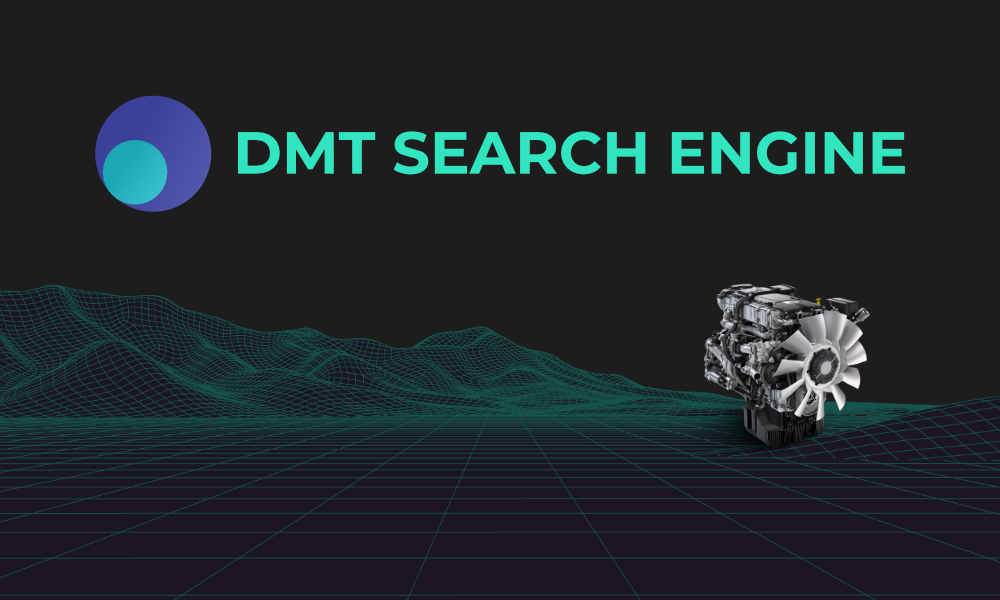
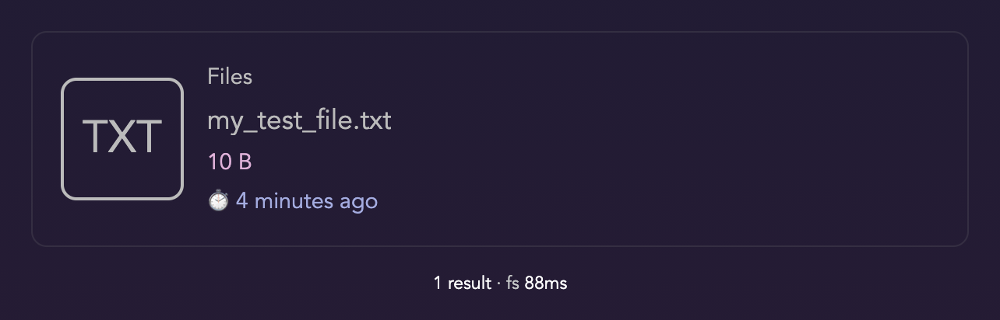

## Project background

This is a fully decentralized search engine without any [bootnodes](https://ethereum.stackexchange.com/questions/44265/how-does-a-bootnode-work). It can be used on one or more users’ machines and nodes can interconnect. One node running in production is [ZetaSeek.com](https://zetaseek.com), it serves as a demo and also has useful content focused on modern Web3 technologies. It <i>follows (has a long-running connection to)</i> some other public Zeta nodes which means that you search on the entire subnetwork / subgraph when typing queries into ZetaSeek GUI. 

⚠️ **It is suitable for curious early adopters.** Everything implemented *should just work*, **there are no known bugs** but the ease of setup and usage will be much better as times goes on.

Anyone installing the software locally can also easily download zetaseek search index and search over it fully in private. This is described in detail in part two of this tutorial. You can also add your own links and use this as a cool bookmarking service / search engine. Searches directly in file system are also very much supported. 

This is a longterm project, we’re in 2nd year now. Here is the [developer portal](https://dmt-system.com) in development :) 👷It will progress in Q4 2021.

The entire project is fully open source with no plans of monetization, just searching for some valuable people to run public nodes so they can follow each other (node to node follow means that searches on one node go to all peers in cluster). This helps users (including the developers working on this project) find more great stuff on the internet without any gatekeepers / middlemen.

Users can, of course, only choose to use this technology on their own local network or only localhost at first (or forever) as well. **It is flexible.** When running a public node they can only choose to reveal its location to selected people as they see fit.

## 2. This is part two of the tutorial (server)

**Or it can be part one as well, it depends!**

If you want to start with your local DMT Search node on your Personal Computer, [FOLLOW PART ONE](./TRY_DMT_SEARCH.md) first.

You can then continue with this guide. Any order actually works, depending on your preferences and priorities.

## Get your own fully independent public Search Node

A `dmt-proc` instance which is publicly accessible (has public IP) is nicknamed **Zeta node**.

🔎 Here is one example of such [Zeta node](https://zetaseek.com). There are others as well. Visit [DMT SYSTEM](https://dmt-system.com) website for some more background info.

**DMT Search** is one of the main apps running on DMT SYSTEM. Zeta nodes expose this search interface by default.

Installation takes around ⏱️**10 min** in optimal scenario and a few minutes more if you're doing it for the first time.

Along the way you learn the basics about **servers**. In near future the smartest people will want to run their own servers for many purposes.

It is not that hard and we help you because we are <i>searching for great people</i> to learn from them as well.

We give you software and knowledge how to set it up, you collect interesting links, decide to share some and we all benefit.

Nowadays **sense-making** is challenging and can only be done optimally through re-envisoned, modern and transparent approaches.

Positive sum, fluid, infinitely scalable search and social platforms are the future. 

Ours is one such platform and besides we use it to suggest other great complementary solutions through our decentralized sense-making machine you can be easily part of. You can also decide to remain an island without any live connections to existing well known Zeta nodes. You could build your own community around your (initially) disconnected node instead. You can also sync other people's search indices for anonymous, private, offline use.

**Options are almost endless and it all just works!** There is no magic involved, just a lot of determinism ;)

Let's start setting up your **Zeta node**! 

To restate: Zeta node is a public DMT node with DMT Search interface exposed. Public in the sense that anyone knowing your regular domain / address can see the search box and type into it. It is not connected to any other existing search nodes by default.

### Prerequisites

**Get a fresh** Debian/Ubuntu linux server** (from [DigitalOcean](https://www.digitalocean.com/)?) and ⚙️ [SET IT UP](./SERVER_SETUP.md) (⏱️ **5 min**)

---

### Login to your server

Now login to your **⚡new remote computer⚡** with your *non-root username*:

```bash
ssh username@ip
```

 continue with setup:

```bash
sudo apt-get update
sudo apt-get -y install git
```

### Get DMT ENGINE

⏱️ **2 min**

This is the 🚂 **engine** that runs our node and connects to other network nodes.

Install (everything stays neatly inside the `~/.dmt` directory):

```bash
git clone https://github.com/uniqpath/dmt.git ~/.dmt
cd ~/.dmt
./install
source ~/.bashrc
```

(ignore the `node.js is not installed` message for now).

### Setup the search node

⏱️ **3 min**

```bash
zeta_setup
```

Remember to logout and login if you get this error: `zeta_setup: command not found`.

The correct **welcome screen** indicating that the script is ready to run looks like this:


✨**That's it**, follow the instructions on screen 👣 🐇. A few minutes later:

<p align="center"></p>

### ✓ Now you have a successful install 🎉

You should now be able to open `http://server_ip:7777/dmt-search`.

There will be nothing in your search engine though so try this next:

```bash
ssh username@ip

mkdir Files && cd $_

echo "something" > my_test_file.txt
```

And then try entering **test file** search query into the box on your new DMT SEARCH ENGINE.

You will see the test result like this:

<p></p>

## What is search engine without links?

Nothing! [FOLLOW THIS GUIDE](./TRY_DMT_SEARCH.md) to set up a **DMT ENGINE** on your personal computer. 

Links are added and scanned from your main (personal machine) and then fully or partially synced to your public DMT ("Zeta") node.

They need to be scanned from residential IP address because big web properties like Amazon and sites behind Cloudflare block scanning from Digital Ocean and other public IPs.

As you will see our search architecture makes for the most private, resillient and useful system for collecting and managing links (and files!).

# Support info

✉️ **Lighttpd webserver setup** (https, zetaseek subdomain, or **your own domain** etc.) docs *available on request*. 

You can use your own domain as well but you'll have to manage `https` certificate separately, of course.

💡👷 We may switch from lighttpd to **nginx** as a default, more powerul static server once some parts of the system are re-architected a bit. In this current setup we cannot generate search link metadata previews for nice sharing of pre-filled search forms in social media. They always display just the default banner and description :( This is a priority for fixing at last by end of this year (2021).

#### ⚠️ Important

Make sure ports `7777` (for GUI) and `7780` (websocket communication port) are not blocked by a firewall.

💡To manually update `~/.dmt` to new version in the future use: `dmt next`.

See the autoupdate status with `dmt autoupdate` command. It is recommented to keep this enabled.

#### 🆘 Support

For any support questions please [Join our Discord server](https://discord.gg/wBpKWepJra).

You can also use hello@uniqpath.com email to contact your decentralized tech support.

**Happy explorations!** Your journey as a <b>Zeta explorer</b> has just started 🤓. Curiosity is the engine of progress.

[DMT SYSTEM](https://dmt-system.com) provides most amazing tools for fully independent or optionally inter-dependent **Search & Discovery**.

## More resources

[DMT ENGINE Documentation](https://docs.uniqpath.com/dmt) with explanation of core ideas and concepts.
